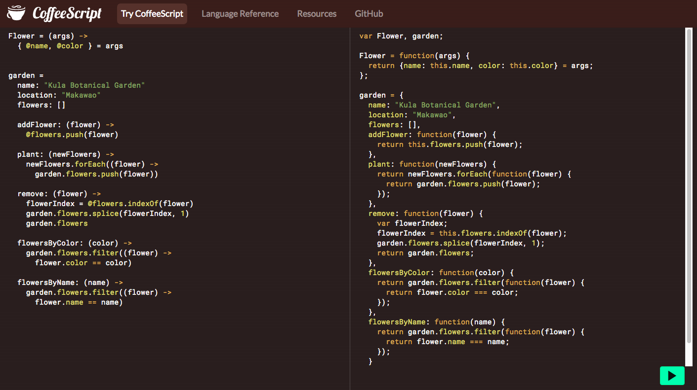

# CoffeeScript

CoffeeScript is a language that renders Javascript using syntax similar to Ruby, effectively banishing the ugly. You know what I mean.

CoffeeScript is popular in Rails, and out of Rails because let's be honest Javascript is an ugly b.

## Translation

Because CoffeeScript is a whole new language and involves a whole lot of new syntax, it is rather tricky to pick up when starting out, as with all new languages. Luckily the CoffeeScript website provides us with a handy guide.



### Basics

Essentially what CoffeeScript does is smooth out the Javascript logic. Gone are all the piles of curly braces and semicolons. We no longer need to use "var" to define a variable. When defining a function, instead of writing out "function" we use an arrow like so: "->". Instead of using "this", we use an "@" as if defining an instance variable.

```

Flower = (args) ->
	{ @name, @color } = args

===

var Flower = function(args) {
	return args = { name: this.name,
									color: this.color }
}

```

We no longer need to use triple equals ("===") when needing to return a boolean. We once again can use double equals ("=="). Additionally, CoffeeScript removes the necessity to explicitly return within any given function as CoffeeScript mimics the implicit return policy of Ruby and returns the last line.

```

(color) ->
	garden.flowers.filter((flower) ->
	 flower.color == color)

===

function(color) {
  return garden.flowers.filter(function(flower) {
    return flower.color === color;
  });
}

```

For loops are also broken down into a simpler syntax. 

```

eat food for food in ['toast', 'cheese', 'wine']

===

var eat = function(food) {
  return `${food} eaten.`;
};

var ref = ['toast', 'cheese', 'wine'];
for (j = 0, len = ref.length; j < len; j++) {
  food = ref[j];
  eat(food);
}

_________________________

function getRandomColor() {
  var letters = '0123456789ABCDEF';
  var color = '#';
  for (var i = 0; i < 6; i++) {
    color += letters[Math.floor(Math.random() * 16)];
  }
  return color;
};

===

getRandomColor ->
  letters = '0123456789ABCDEF'
  color = '#'
  for i in [0..6]
    color += letters[Math.floor(Math.random() * 16)]
  color

```

In conclusion CoffeeScript enables us to use Javascript in a much more accessible fashion. However one should be comfortable with using plain Javascript logic before moving on to using CoffeeScript.

Sources

- Official CoffeeScript Website: http://coffeescript.org/
- CoffeeScript Basics: http://railscasts.com/episodes/267-coffeescript-basics?autoplay=true
- Javascript to CoffeeScript Converter: http://js2.coffee/